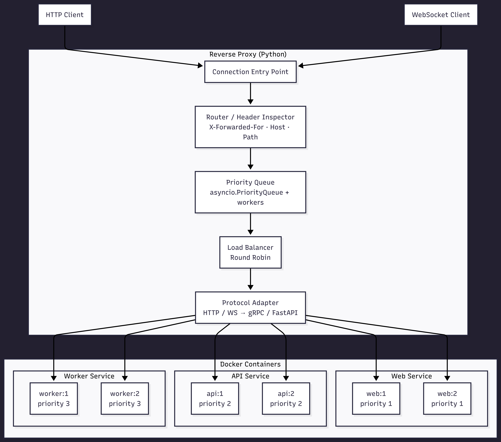

# Reverse Proxy with Load Balancing & Priority Queuing (Projeto RS)

A Python-based reverse proxy  that routes HTTP and WebSocket traffic to multiple Docker containers, featuring Round Robin load balancing, priority-based request queuing, and optional protocol conversion via gRPC or FastAPI.

---

## Overview

This project implements an asynchronous reverse proxy in Python that intercepts client requests, inspects their headers, and forwards them to the correct Docker container. Routing decisions are based on request metadata, especially the `X-Forwarded-For` header.

The proxy is then extended with **Round Robin load balancing**, allowing requests to be evenly distributed across multiple instances of the same service. To improve request handling, a **priority queue** is added using `asyncio`, so higher-priority endpoints are processed first.

Finally, the proxy can communicate with internal services through **gRPC** or **FastAPI**, making the system more efficient while keeping a standard external interface.

---

## Architecture

The following diagram shows the main proxy flow, from incoming client requests to internal Docker services, including routing, priority queuing, load balancing, and protocol adaptation.

---

## Features

### Phase 1 — HTTP Reverse Proxy & Header-Based Routing
The proxy intercepts all incoming HTTP requests and inspects their headers before forwarding. The `X-Forwarded-For` header is used to identify the origin of each request, and other headers such as `Host` or custom headers like `X-Service-Target` are used to decide which internal service should handle the request.

### Phase 2 — Round Robin Load Balancing
When multiple containers of the same type are running (e.g. two web server instances), the proxy distributes incoming requests evenly across them using a Round Robin algorithm. This ensures no single container is overloaded while others sit idle.

### Phase 3 — Priority-Based Request Queue
Incoming requests are placed into an `asyncio.PriorityQueue` before being forwarded. Each endpoint or request carries a priority level — higher priority requests are always processed first, regardless of arrival order. Multiple async workers consume from the queue concurrently, ensuring throughput is maintained even under heavy load.

### Phase 4 — Protocol Optimization
The proxy accepts external connections over HTTP and WebSockets, but communicates with internal services via gRPC or async FastAPI. This protocol conversion layer demonstrates how a proxy can act as a bridge between different communication paradigms, optimizing internal traffic while keeping the external API simple and standard.

---

## References

- [aiohttp Documentation](https://docs.aiohttp.org/en/stable/)
- [asyncio.Queue — Python Docs](https://docs.python.org/3/library/asyncio-queue.html)
- [asyncio PriorityQueue — SuperFastPython](https://superfastpython.com/asyncio-priorityqueue/)
- [gRPC Python Quickstart](https://grpc.io/docs/languages/python/quickstart/)
- [FastAPI Async Guide](https://fastapi.tiangolo.com/async/)
- [Docker Compose Docs](https://docs.docker.com/compose/)