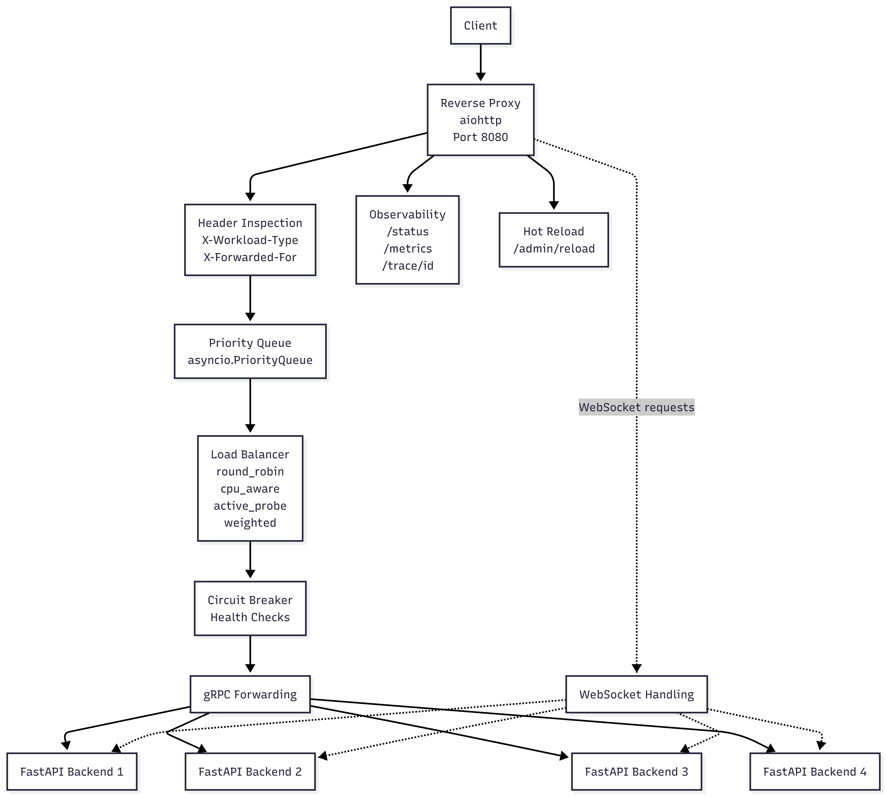

# Reverse Proxy & Load Balancer

Projeto desenvolvido no âmbito da disciplina de Redes e Serviços (RS), com o objetivo de implementar um reverse proxy assíncrono em Python com suporte para múltiplos serviços backend.

O sistema recebe pedidos HTTP e WebSocket através de um proxy principal, que fica responsável por encaminhar cada pedido para um dos backends disponíveis. Para isso, foram implementados mecanismos de load balancing, priority queue, health checks, circuit breaker, métricas, tracing, gRPC forwarding e hot reload da configuração.

A solução foi executada em Docker, com vários containers backend a simular servidores independentes, permitindo testar distribuição de carga, falhas, recuperação de serviços e diferentes estratégias de encaminhamento.

---
##Grade: 17/20
---

## Architecture



---

## Technologies Used

- Python
- aiohttp
- asyncio
- FastAPI
- Docker
- Docker Compose
- aiodocker
- gRPC
- WebSockets


---

## Project Structure

```text
ProjetoRS/
├── docker-compose.yml
├── Dockerfile
├── config/
│   ├── config.json
│   └── config.remote.json
├── docs/
│   └── imgs/
│       └── arch.png
├── proxy/
│   ├── Dockerfile
│   ├── main.py
│   ├── load_balancer.py
│   ├── priority_queue.py
│   ├── circuit.py
│   └── protos/
│       └── service.proto
└── src/
    └── main.py
```

---

## Main Components

### Backend Services

The backend services are small FastAPI applications used to simulate real application servers.

Each backend exposes endpoints for health checks, testing, CPU/memory stress and WebSocket communication.

Main backend responsibilities:

- respond to normal HTTP requests
- expose `/ping` for basic availability checks
- expose `/healthz` for health information
- simulate CPU load
- simulate memory pressure
- support WebSocket communication
- receive requests forwarded by the proxy

---

### Reverse Proxy

The reverse proxy is the main entry point of the system.

It receives client requests on port `8080`, processes the request metadata and forwards the request to one of the available backend containers.

Main proxy responsibilities:

- receive external requests
- generate an `X-Request-ID`
- preserve and extend `X-Forwarded-For`
- filter hop-by-hop headers
- place requests in a priority queue
- choose a backend using the configured load balancing strategy
- forward the request
- collect metrics
- expose system status

---

### Priority Queue

The proxy uses an `asyncio.PriorityQueue` to control the order in which requests are processed.

Requests with higher importance can be processed before normal or batch requests.

Priority example:

```text
1  -> high priority requests
5  -> normal requests
10 -> low priority / batch requests
```

If the queue becomes full, the proxy returns:

```text
429 Too Many Requests
```

This avoids accepting unlimited requests when the system is overloaded.

---

### Load Balancing

Several load balancing strategies were implemented.

#### Round Robin

Distributes requests evenly between the available backend containers.

#### CPU Aware

Uses Docker stats to choose the container with lower CPU usage.

#### Active Probe

Periodically checks backend availability and latency using health probes.

#### Weighted

Combines multiple metrics such as CPU usage, memory usage and active connections to choose the best backend.

---

### Circuit Breaker

Each backend has an associated circuit breaker.

When a backend fails repeatedly, the proxy temporarily stops sending requests to it. After a recovery period, the backend can be tested again before being fully reintroduced.

Circuit states:

```text
closed     -> backend is healthy
open       -> backend is temporarily blocked
half-open  -> backend is being tested for recovery
```

This prevents the proxy from continuously sending traffic to unhealthy services.

---

### Health Checks and Metrics

The proxy exposes several endpoints to inspect the system.

```bash
GET /status
```

Shows the current state of the proxy, active load balancer, backend containers, reachability and circuit breaker state.

```bash
GET /metrics
```

Shows information such as uptime, total requests, requests per container, errors per container and Docker stats.

```bash
GET /trace/{id}
```

Shows the internal timeline of a specific request using its request ID.

---

### Hot Reload

The proxy supports hot reload of the backend configuration.

The list of backend containers can be changed in the configuration file and reloaded without restarting the whole system.

```bash
POST /admin/reload
```

This allows adding or removing backend containers dynamically while the proxy is running.

---

## How to Run

Start the full system with Docker Compose:

```bash
docker compose up --build
```

The proxy will be available at:

```text
http://localhost:8080
```

Useful endpoints:

```bash
curl http://localhost:8080/status
curl http://localhost:8080/metrics
curl http://localhost:8080/api/test
```

Backend containers can also be accessed directly for debugging:

```text
web1 -> http://localhost:8001
web2 -> http://localhost:8002
web3 -> http://localhost:8003
web4 -> http://localhost:8004
```

---
